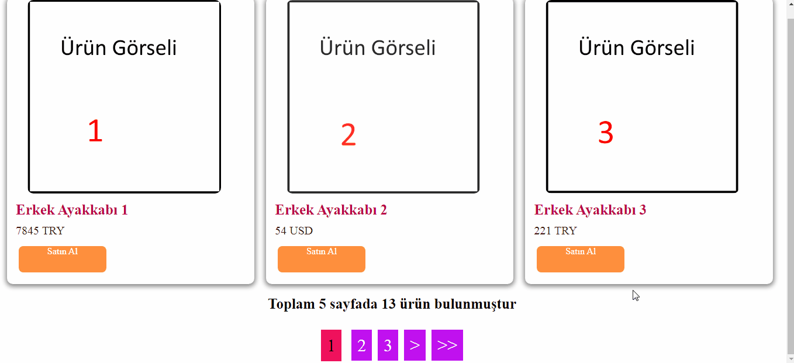

## About The Project
rating for web pages



### Built With

* [CSS](https://html.com/)
* [HTML](https://html.com/)
* [PHP](https://www.php.net/)


## Getting Started
### (En)
You can download the files and arrange them according to your own. I wrote down the way of working in it index.php.


### (TR)
İndirip kendinize göre şekillendirebilirsiniz. index.php içinde detaylı şekilde yazdım çalışma şeklini.

### Installation
1. Clone the repo
   ```sh
   git clone https://github.com/baradielbenimulan/PHP-Sayfalama.git
   ```

## Contact
Şamil Servet Avcı - [@samilservet](https://twitter.com/samilservet) - bekekgaj@gmail.com
